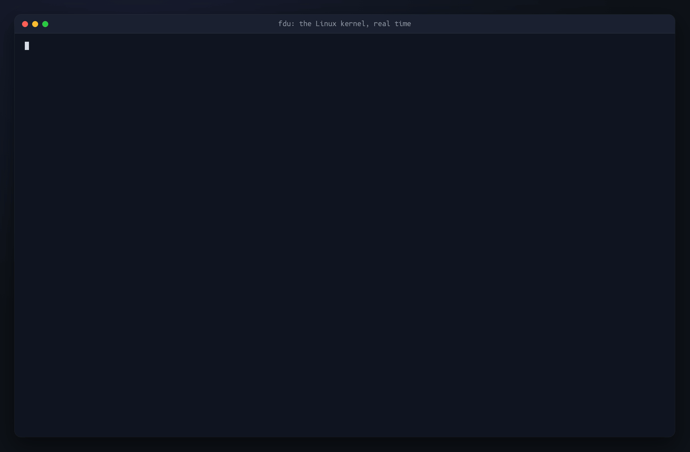

# fdu

**Fastest du replacement, with `.gitignore`-aware sizes and code and document counts,
for the command line, Python, and Rust**

For every directory in a tree at once, fdu reports its size, file count, most recent
change, file kinds, and how much of it `.gitignore` covers.
On request it also counts lines of code by language and words in documents.
One parallel walk through each platform’s native directory interface gathers the
metadata, and on a generated million-entry tree (875,000 files) fdu finished ahead of
`du` and the seven other disk-usage tools measured ([Speed](#speed)). Content counts
also read the files and are cached between runs.
The same engine is the `fdu` command, a Python package, and a Rust crate, with versioned
JSON output and a live change feed.
For interactive browsing and deletion, or line counts in hundreds of languages, another
tool fits better: see [when to use each](#comparison-to-alternatives).

[](https://github.com/jlevy/fdu/releases/latest/download/fdu-demo.mp4)

*fdu 0.4.0 on the Linux kernel source (1.7 GiB, 95,938 files), recorded in real time on
an M1 Pro: one run of each command, not a benchmark.
Click to download the full-resolution video (MP4, 4.5 MB).*

<!-- The speed claim above is repeated, without numbers, in crates/fdu/README.md,
crates/fdu-py/README.md, crates/fdu/src/skills/SKILL.md, and the --docs guide in
crates/fdu/src/cli.rs, whose output tests/golden/cli-surface.tryscript.md and
tests/parity/deviations-python.diff record. The tagline is also the description in
crates/fdu/Cargo.toml and crates/fdu-py/pyproject.toml. Update them together. -->

**Status:** 0.x. A minor release may change the command line or either API; see the
[release process](docs/project/guides/release-process.md).

## Key Features

- **Every directory at once:** One walk gives each directory’s size, file count, and
  newest change, as a bounded tree (`fdu .`), one total (`--view=summary`), the largest
  or most recent files, or breakdowns by file type, family, extension, and language.
- **`.gitignore`-aware sizes:** Rows show how much of their size the tree’s own
  `.gitignore` files cover, and `--ignored=exclude` or `--ignored=only` reports one
  side. Rules apply per directory, as git applies them; `.git/info/exclude` and global
  ignore files are not read.
- **Code and documents:** `--view=code` counts code, comment, and blank lines for each
  of 15 languages, over the tree or any directory you name; the Rust API’s
  `content_rollup` also gives each directory’s totals across languages.
  `--view=documents` counts words, paragraphs, and pages in prose and markup.
  Results are cached, so a repeated run reads only the files that changed.
- **Find and inventory:** Select entries by kind, glob, size, and age, such as every
  `node_modules` untouched for 30 days, and print them as a tree, plain paths,
  size-and-age rows, or a complete JSON inventory.
- **Live updates:** `--watch` keeps a report current from the platform’s native file
  events (FSEvents, inotify, `ReadDirectoryChangesW`) and can stream each change as JSON
  Lines.
- **For scripts, agents, and programs:** JSON, JSON Lines, and YAML carry a versioned
  schema; `fdu --install-skill` gives coding agents a self-contained skill; and the same
  engine is a Python package and a Rust crate.

## Set Up with Any Coding Agent

Hand any coding agent this one instruction:

> Run `uvx --no-build fdu@latest --install-skill` from the project root to install fdu’s
> self-contained skill for current and future agent sessions.

The command writes `.agents/skills/fdu/SKILL.md` and `.claude/skills/fdu/SKILL.md` under
the project root. The skill needs no prior session context and uses `fdu` on `PATH` or a
wheel-only `uvx` fallback; no installed command or Rust toolchain is required.

Use `--agent-base DIR` to write `DIR/skills/fdu/SKILL.md` for one agent’s user scope,
such as `~/.claude`. Re-run the installer after upgrading to refresh the skill;
`fdu --skill` prints it, and deleting the generated skill directories removes it.
See the [skill usage guide](docs/usage.md#agent-skill).

## Install the Command Line

fdu is published as prebuilt wheels on PyPI, so [uv](https://docs.astral.sh/uv/) is all
you need; no Rust toolchain is required.
Run the latest release once, or install it as a command and upgrade it later:

```shell
uvx --no-build fdu@latest .
uv tool install --no-build fdu
uv tool upgrade --no-build fdu
```

`pip install fdu` installs the same command along with the
[Python package](#as-a-python-module), and `cargo install --locked fdu` builds it from
source with Rust 1.85 or newer.
Wheels cover Linux (glibc), macOS, and Windows x86-64; for other platforms, pinned
versions, and uv cool-off policies, see [Other Ways to Install](#other-ways-to-install).

## Quick Start

The samples on this page come from a fresh clone of this repository at revision
`55d66863`; your numbers will differ.
A one-level summary of the clone, its hidden `.git/` directory included:

```console
$ fdu . --depth=1
██████████   100%      63 MiB  . 1,185 files (4.0 KiB gitignored)
████░░░░░░    41%      25 MiB    .git/ 28 files
████░░░░░░    38%      24 MiB    docs/ 492 files
█░░░░░░░░░     9%     5.5 MiB    crates/ 126 files
█░░░░░░░░░     8%     4.8 MiB    explorations/ 286 files
░░░░░░░░░░     2%     1.2 MiB    tests/ 112 files (4.0 KiB gitignored)
░░░░░░░░░░     1%     700 KiB    scripts/ 43 files
░░░░░░░░░░     2%     972 KiB    … and 98 more files
```

The result goes to stdout.
On stderr, notes and a suggestion follow, then a `perf:` line with the run’s timing,
left out here:

```text
note: totals include gitignored sizes and descendants
note: display limits: below 1% of root, depth 1
tip: show more: --min-share=0% --depth=all
```

Sizes are allocated disk space, as `du` reports by default, and `--size=apparent` gives
file lengths. On Windows, allocated size falls back to file lengths; see
[allocation and shared files](docs/usage.md#allocation-and-shared-files).

`--view` chooses what is reported, and several views share one walk.
Only `code` and `documents` read file contents; every other view reads metadata and
`.gitignore` files. `--analyze` adds analysis to the others, such as code lines in
`--view=languages`.

| Question | Command |
| --- | --- |
| Which directories are large? | `fdu .` |
| Lines of code and words in documents | `fdu . --view=code,documents` |
| One total for the tree | `fdu . --view=summary` |
| Languages by space | `fdu . --view=languages` |
| File families, types, and extensions | `fdu . --view=families,types,extensions` |
| Twenty largest files | `fdu . --view=largest` |
| Ten most recently changed working files | `fdu . --view=recent --limit=10 --ignored=exclude --exclude='.git/**'` |
| Totals without gitignored entries | `fdu . --ignored=exclude --view=summary` |
| Stay on one filesystem, like `du -x` (macOS and Linux) | `fdu . --one-filesystem` |
| Machine output | `fdu . --format=json` |
| Keep the tree live | `fdu . --watch` |

Content analysis, `--watch`, and the libraries’ `open` keep their state under
`~/.cache/fdu` (`%LOCALAPPDATA%\fdu` on Windows), and a plain `fdu PATH` writes nothing.
`fdu --cache-status=all` lists what is stored, and `fdu --cache-clear=all` removes it.

`fdu --help` lists every flag, `fdu --docs` prints the offline guide, and the
[usage guide](docs/usage.md) covers every view, format, and exit status.

## Understand a Codebase

Lines of code by language and words by document type, from one scan of the same clone:

```console
$ fdu . --view=code,documents
CODE
Code lines   Share  Comments   Blank  Analyzed files  Language
    91,431   55.5%    15,702   7,488         102/102  Rust       (0 gitignored)
    61,533   37.3%     2,512   7,291         163/163  Python     (0 gitignored)
     6,182    3.8%       747     516           33/33  JavaScript (0 gitignored)
     2,709    1.6%       251     155           20/20  C          (0 gitignored)
     1,942    1.2%       252     206           35/35  TypeScript (0 gitignored)
     1,009    0.6%       386     135           31/31  Shell      (0 gitignored)
        13   <0.1%         4       1             2/2  Swift      (0 gitignored)
         6   <0.1%         4       1             2/2  C++        (0 gitignored)
         3   <0.1%         3       1             1/1  C#         (0 gitignored)
         3   <0.1%         4       0             1/1  Go         (0 gitignored)
         3   <0.1%         4       0             1/1  PHP        (0 gitignored)
         2   <0.1%         4       1             1/1  Java       (0 gitignored)
         2   <0.1%         4       1             1/1  Kotlin     (0 gitignored)
         2   <0.1%         4       1             1/1  Ruby       (0 gitignored)
         2   <0.1%         4       1             1/1  SQL        (0 gitignored)
         —       —         —       —             0/2  Make
         —       —         —       —             0/1  Perl
   164,842  100.0%    19,885  15,798         395/398  TOTAL      (0 gitignored)

DOCUMENTS
   7.5 MiB   67.9%  markdown           381 files, 145,935 lines (129,677 nonblank, 16,258 blank), 651,479 words (2,605.9 pages), 8 generated, 346 documentation
   1.6 MiB   21.8%  text               66 files, 31,754 lines (31,571 nonblank, 183 blank), 209,075 words (836.3 pages), 10 documentation
   648 KiB   10.3%  html               2 files, 2,354 lines (2,319 nonblank, 35 blank), 98,515 words (394.0 pages), 1 documentation
```

On stderr, before the `perf:` line:

```text
note: percentages are shares of code lines (CODE), document words (DOCUMENTS)
note: 15 languages analyzed
note: not analyzed: 3 unsupported
note: 49 files with unclassified type
```

Code lines leave out comments and blank lines, which have columns of their own.
Analyzed files counts the files measured out of the source files selected, and a
language fdu has no counter for shows a dash rather than zero, as Make and Perl do.
The notes count unsupported and unclassified files instead of treating them as zero
lines. In DOCUMENTS, a page is 250 words (`--words-per-page`), and the suffix counts
files detected as generated or as documentation.

Each language row shows its gitignored share.
`--ignored=exclude` skips gitignored trees such as local builds and environments,
without walking or reading them.
`--limit=5` keeps the five largest languages, while the TOTAL row and the notes still
account for the rest, and `--format=json` gives structured counts and coverage.
See [content analysis](docs/usage.md#analyze-file-contents) for the counting convention
and supported languages.

## Find Environments and Build Outputs

List every `.venv`, `node_modules`, and Cargo `target` directory under a work directory,
largest first, with its allocated size and the age of its newest change:

```shell
fdu ~/work --kind=dir --include=.venv --include=node_modules --include=target --full --long
```

Add `--modified-before=30d` for the ones untouched in a month, or
`--sort=mtime --reverse` for oldest first; replace `--long` with `--format=paths` for
paths alone. `--view=summary` gives their combined usage and counts nested matches once;
`--view=files,summary --format=json` gives exact rows and the total in one report.
Add `--cache=on` to keep the scan, and a later run with `--stale-ok` answers from it
without walking again.

A directory’s size counts the regular files below it, and its age is the newest
modification of the directory or anything in it, which measures activity, not last use.
Ignored directories are included, and symlinks are not followed.
Sizes are per path, not space freed by deletion: hard links and copy-on-write clones, as
uv environments use, can share storage.
See [allocation and shared files](docs/usage.md#allocation-and-shared-files).

## Export Inventories and Search Files

`--full` lifts every display bound.
It is shorthand for `--depth=all --breadth=all --limit=all --min-share=0%`, explicit
bounds override it, and it changes neither what is scanned nor what is analyzed.

```shell
fdu . --view=tree --full --format=json                    # the complete recursive tree
fdu . --kind=dir --full --sort=name --format=json         # every directory, recursive usage
fdu . --view=files --kind=file --full --format=json       # every regular file
fdu . --kind=file --include='*.rs' --full --format=paths  # Rust files, like find or fd
```

Paths output is a find/fd-style search, and JSON gives the same selection with exact
usage fields. Directory rows hold recursive totals and can overlap; regular-file rows
hold each file’s own size.
See
[complete inventories and find/fd examples](docs/usage.md#find-files-and-export-complete-inventories)
and the [machine-output reference](docs/machine-output.md).

## Live Updates

`--watch` is the same query, re-evaluated as the tree changes:

```shell
fdu . --watch
fdu . --watch --view=files --format=jsonl
```

Changes arrive as the platform’s native file events (FSEvents, inotify,
`ReadDirectoryChangesW`), so an idle tree is not polled, and each event is checked with
a fresh `stat` before it changes the result.
`--interval` throttles how often a text view repaints, not how changes are detected.
On macOS, the kernel reports writes to a file only when it is closed, so a file held
open for writing, such as a growing log or database, shows its size as of its last
close. Content analysis is one-shot and cannot be combined with `--watch`.

Library callers get the same feed as typed values: Rust `Session` (behind the `watch`
build feature) and Python `Index.watch()`. An interactive client, such as a file
browser, uses `OpenedIndex` in Rust or `fdu.opened` in Python: it answers while the
first walk is still running, reads large results a page at a time, and resumes its
change feed from a cursor; see
[long-lived roots](crates/fdu-py/README.md#long-lived-roots).

## As a Python Module

Add the package to a uv project, or install it in the current Python environment:

```shell
uv add fdu
pip install fdu
```

The same wheel installs the native `fdu` command; there is no Python reimplementation of
the command line.

```python
from pathlib import Path

import fdu

# One question: a one-shot report, as the command line runs it.
report = fdu.report(Path("."), fdu.Query(views=(fdu.View.CODE, fdu.View.DOCUMENTS)))
print(report.render())  # the same tables as `fdu . --view=code,documents`

# Many questions: open a retained index once and ask it repeatedly.
index = fdu.open(Path("/path/to/tree"))
print(index.total().files, index.status.complete)
report = index.report(fdu.Query(views=(fdu.View.LANGUAGES,)))
print(report.as_dict())  # the command line's JSON report, as a dict
mark = index.clock
index.refresh()
print(index.since(mark).changes)
```

The watch feed is a live iterator; it does not return:

```python
from pathlib import Path

import fdu

index = fdu.open(Path("/path/to/tree"))
with index.watch() as stream:
    for batch in stream:
        for change in batch:
            print(change.kind, change.path)
```

Values are frozen dataclasses and enums, native work runs with the GIL released, and
`index.status.complete` and `report.provenance.freshness` say whether an answer is
complete and current.
The [Python package README](crates/fdu-py/README.md) covers every option, report
section, and the long-lived `fdu.opened` interface.

## As a Rust Library

```shell
cargo add fdu
```

`fdu` re-exports the engine.
The default `watch` build feature adds the OS-native watch layer;
`cargo add fdu --no-default-features` leaves it out.
An embedding that wants none of the command line’s dependencies depends on `fdu-core`
instead. The API reference is on [docs.rs/fdu](https://docs.rs/fdu) and
[docs.rs/fdu-core](https://docs.rs/fdu-core).
`open` retains an index for many questions; `prepare_report` answers one report without
retaining one. Content analysis is opt-in: `content: Default::default()` scans metadata
only.

```rust
use fdu::content::AnalysisSet;
use fdu::query::{Basis, Delivery, Scope};
use fdu::{CachePolicy, open};
use std::path::Path;

fn main() -> Result<(), fdu::Error> {
    let basis = Basis {
        root: Path::new(".").into(),
        scope: Scope::default(),
        content: AnalysisSet::ALL,
    };
    let delivery = Delivery::new(CachePolicy::Auto, None);
    let (index, _report) = open(&basis, &delivery)?;
    let total = index.total();
    println!("{} files, {} bytes", total.files, total.bytes);

    // Per-directory roll-ups are already computed; this is not another walk.
    let src = Path::new("src");
    if let Some(rollup) = index.rollup(src) {
        println!("src/: {} files, newest {}", rollup.files, rollup.newest_mtime_ns);
    }
    if let Some(content) = index.content_rollup(src) {
        println!("src/: {} code lines", content.total.code.metrics.code_lines);
    }
    Ok(())
}
```

Later questions reuse the index; `refresh` reconciles it against the tree, and with
`watch` enabled, `fdu::session::Session` answers the same request as events arrive.

## Speed

fdu is fast by measured selection.
Before writing a walker, the project read the source of the disk-usage tools and walkers
it found (dust, dua, gdu, ncdu, dut, bfs, and fd first; pdu, diskus, and dumac later)
and listed what set the fastest apart.
Each technique became a hypothesis for an agent-run
[performance loop](docs/project/guides/performance-loop.md), which makes one change at a
time, measures it against the previous build in interleaved pairs, and keeps it only
when it is at least 3% faster with a 95% interval below zero.

- **Taken from peers:** a bounded pool of breadth-first walkers; `getattrlistbulk` on
  macOS, as dumac uses; raw `getdents64` and directory-relative `statx` on Linux, as dut
  and bfs use, where pdu, diskus, and dust stat full paths; and, like pdu, a summary or
  default tree that keeps only what it prints while still counting every entry.
- **Measured and rejected:** io_uring, as bfs uses, measured several times slower, and
  larger read buffers and deeper worker pools were no faster.
- **Added beyond them:** `.gitignore` classification on by default, which pdu, diskus,
  and dust do not read; a worker count chosen from measured service time, which no
  surveyed tool adapts; a saved scan revalidated by modification time; and a content
  cache that rereads only changed files, neither of which any surveyed tool has.

[The file roll-up engine survey](docs/project/research/research-2026-08-06-file-rollup-engine.md),
[the Linux peer study](docs/project/research/research-2026-09-29-linux-peers-matchers-and-hot-path.md),
and
[the pdu brief](docs/project/research/research-2026-09-28-pdu-and-the-linux-peer-gap.md)
record each technique and its verdict, rejected ones included.
Changes the loop kept include these, with their measured effects:

- **Parallel bulk reads:** Threads walk the tree at once, and on macOS `getattrlistbulk`
  returns many entries’ names and sizes per call (with the rest of the first campaign,
  54.5% less time for a cold scan on macOS and 52.0% for re-checking a saved one;
  [exp-032](docs/project/experiments/exp-032-cumulative-effect-through-bounded-parallel-reconciliation.md)).
- **A native directory reader on Linux:** `getdents64` fills a reused buffer, and
  `statx` reads each entry relative to its directory (9–10% less time for
  `--view=summary` on two real trees, and 4% for the default tree on one of them;
  [exp-185](docs/project/experiments/exp-185-linux-h169-native-directory-reader-cuts-the-summary-6-10-and.md),
  [exp-186](docs/project/experiments/exp-186-linux-h169-native-directory-reader-cuts-the-summary-8-9-on-l.md)).
- **Summaries without an index:** A summary is totalled as the walk runs (14.6% less
  time on macOS and 95% less memory;
  [exp-040](docs/project/experiments/exp-040-derive-an-exact-rich-summary-without-building-an-index.md)).
- **Indexed `.gitignore` rules:** Rules are matched without allocating, chained per
  directory listing, and bucketed by literal name, extension, and suffix, so most
  entries are classified without running a glob (46.2%, 35.9%, and 29.6% less time on
  the Linux kernel source’s default tree;
  [exp-173](docs/project/experiments/exp-173-linux-h162-allocation-free-gitignore-matching-halves-the-def.md),
  [exp-174](docs/project/experiments/exp-174-linux-h163-per-listing-control-chains-cut-another-third-from.md),
  [exp-178](docs/project/experiments/exp-178-linux-h171-bucketed-gitignore-matching-cuts-the-default-tree.md)).
- **A default tree that keeps only what it shows:** Files too small to reach a row fold
  into their directories’ totals (13.5% less time on the kernel source;
  [exp-180](docs/project/experiments/exp-180-linux-h172-exact-transient-tree-tier-cuts-the-default-tree-1.md)).
  On the generated million-entry tree, 0.3.0’s default tree peaks at 57 MiB of memory,
  where 0.2.1’s peaked at 293 MiB
  ([exp-202](docs/project/experiments/exp-202-linux-the-0-3-0-release-end-to-end-the-default-tree-48-faste.md)).

[The evidence report](docs/project/reports/report-2026-08-20-fdu-performance-evidence.md)
records every experiment, rejected ones included.

Time to report on the generated million-entry tree, 875,000 files and 2.99 GB of
allocated space, with warm filesystem caches, as a multiple of fdu’s time (lower is
faster):

| Tool | Linux | macOS, exploratory |
| --- | ---: | ---: |
| **fdu** | **1.00×** (0.95 s) | **1.00×** (6.4 s) |
| [pdu](https://github.com/KSXGitHub/parallel-disk-usage) `--max-depth 2` | 1.19× | — |
| [diskus](https://github.com/sharkdp/diskus) | 1.24× | 1.42× |
| [pdu](https://github.com/KSXGitHub/parallel-disk-usage) | 1.25× | 1.49× |
| [dust](https://github.com/bootandy/dust) | 1.62× | 1.57× |
| [gdu](https://github.com/dundee/gdu) | 2.58× | 1.67× |
| GNU [du](https://www.gnu.org/software/coreutils/) | 2.60× | 10.6× |
| [ncdu](https://dev.yorhel.nl/ncdu) | 2.74× | 10.7× |
| [dua](https://github.com/Byron/dua-cli) | 3.34× | 1.61× |
| [dumac](https://github.com/healeycodes/dumac#readme) | — | 1.09× |
| BSD `du` | — | 9.0× |

Linux is a 4-vCPU virtual machine on ext4. pdu, `pdu --max-depth 2`, and diskus ran
beside fdu 0.3.0 (0.95 s) on 2026-09-30. The other Linux tools ran a day earlier beside
the pre-release engine `ebc06c78` (1.09 s), so their multiples are of that engine’s time
and understate 0.3.0’s lead.
On the two real trees, every tool took 29% to 38% longer in the 0.3.0 session than
earlier that day, and about ten points of the 19% gap to `pdu --max-depth 2` on this
tree are probably that session rather than fdu.
macOS is one exploratory session on an M1 Pro’s APFS SSD, on 2026-09-28, with a
pre-0.2.0 build on a heavily loaded, uncontrolled host; pdu ran there as
`--max-depth 1`. It is exploration, not a claim the project’s
[performance loop](docs/project/guides/performance-loop.md#host-pressure-regimes) would
accept, and dumac, the closest tool there, was measured only on macOS. Windows has no
measurements. fdu’s default report covers about 920,000 files and 3.1 GB a second on
Linux (fdu 0.3.0), and 137,000 files and 0.47 GB a second on macOS (the pre-0.2.0
build); these are metadata rates, since sizing a file reads none of its contents.
[Performance Measurements](docs/performance-measurements.md) has each run’s intervals,
memory, and what each tool returns.

Counting source lines reads every byte.
On a copy of the Linux v6.12 source without `.git`, 86,618 files and 1.48 GB, fdu 0.3.0
ran `fdu --analyze=code --view=code --no-gitignore --cache=off` in 8.2 s, about 10,600
files and 0.18 GB a second; [scc](https://github.com/boyter/scc) took 1.4 s and
[tokei](https://github.com/XAMPPRocky/tokei) 2.2 s, each with ignore rules off.
Run again under the default cache policy, fdu answered from its content cache in 0.55 s,
about 158,000 files a second and 2.5 times as fast as scc.
These are medians of 12 adjacent pairs on the same Linux host, on 2026-09-30; see
[source-line counting](docs/performance-measurements.md#source-line-counting).

## Comparison to Alternatives

Many tools report disk usage, and this is how fdu compares with the ones people most
often reach for, and with the two leading source-line counters for its code analysis.
Each cell was checked against that tool’s source or documentation; [Speed](#speed)
compares their run times.
✅ means the tool does what the row names, text alone means partial or different support,
❌ means none (any text says what the tool does instead), and — means the row does not
apply:

| Feature | fdu | du | ncdu | dust | dua | gdu | pdu | diskus | dumac | scc | tokei |
| --- | --- | --- | --- | --- | --- | --- | --- | --- | --- | --- | --- |
| Plain total | ✅ `--view=summary` | ✅ `-s` | ❌ TUI or export | ✅ `-d 0` | ✅ total row | ✅ `-ns` | ✅ `-d 1` | ✅ | ✅ | —² | —² |
| Tree breakdown and pruning | ✅ depth, breadth, minimum share, row limit | ✅ depth, size floor | TUI browsing | ✅ depth, top N, size floor | depth; TUI browsing | depth, top N files; TUI browsing | ✅ depth, minimum share | ❌ | ❌ | ❌ per language or file | ❌ per language or file |
| `.gitignore` | ✅ classify; include, exclude, or only ignored | ❌ | ❌ | ❌ | partial: TUI dims ignored entries; `--ignore-from` patterns | ❌¹ | ❌ | ❌ | ❌ | ✅ exclude | ✅ exclude, inside a git repository |
| Source code analysis² | ✅ 15 languages: code, comment, and blank lines; per directory in the Rust API | ❌ | ❌ | ❌ | ❌ | ❌ | ❌ | ❌ | ❌ | ✅ 366 languages; complexity and cost estimates | ✅ 333 languages; embedded languages |
| Code analysis speed, Linux source³ | 8.2 s; 0.55 s repeated | — | — | — | — | — | — | — | — | 1.4 s | 2.2 s |
| Text analysis | ✅ lines, words, paragraphs, pages | ❌ | ❌ | ❌ | ❌ | ❌ | ❌ | ❌ | ❌ | ❌ | ❌ |
| APIs and machine output | ✅ Rust, Python; JSON, JSONL, YAML | tab-separated text; `-0` | JSON export | JSON (`-j`) | Rust library; snapshot files | JSON export; SQLite or Badger | ✅ Rust library; JSON | Rust library | ❌ | ✅ Go package; JSON, CSV, HTML, SQL | ✅ Rust library; JSON |
| Watch and stream | ✅ `--watch`, JSONL change stream | ❌ | ❌ | ❌ | ❌ | ❌ | ❌ | ❌ | ❌ | ❌ | ❌ |
| Cached results | ✅ snapshot and content cache, revalidated | ❌ | export, not revalidated | ❌ | snapshot, not revalidated | database, not revalidated | JSON, not revalidated | ❌ | ❌ | ❌ | ❌ |
| Agent skill | ✅ `--install-skill` | ❌ | ❌ | ❌ | ❌ | ❌ | ❌ | ❌ | ❌ | MCP server (`--mcp`) | ❌ |

**When to use each:** ncdu, dua, and gdu let you browse a tree and delete from it
interactively, which fdu does not; gdu can also serve a browser view, and `dua clean`
finds build products to remove.
`du` is already installed on every Unix-like system.
diskus and dumac answer one total from a small binary, and pdu draws a compact size
chart; they are the closest to fdu in speed.
For line counts alone, use scc or tokei: they count hundreds of languages to fdu’s 15,
tokei counts embedded code, scc estimates complexity, and both count a large tree
several times as fast as fdu’s first run, though fdu’s cached repeat is faster than
either. Use fdu for a tree you can prune, a `.gitignore`-aware answer, content metrics,
versioned machine output, a live or cached view, or a Rust or Python API; for code, it
adds each language’s ignored share, and per-directory counts in Rust.

¹ gdu’s unreleased main branch adds `--ignore-from-gitignore`, which reads patterns from
one file.

² [scc](https://github.com/boyter/scc) and [tokei](https://github.com/XAMPPRocky/tokei)
count source lines, not disk usage, so the disk-usage rows show “—”. They count far more
languages than fdu; tokei also counts code embedded in another language, such as
Markdown code fences, and scc estimates complexity and cost.
On the Linux kernel’s C sources and headers, all three give the same code, comment, and
blank counts for 99.7% of files; the
[SLOC tools survey](docs/project/research/research-2026-09-29-sloc-tools-survey.md)
explains the rest. [cloc](https://github.com/AlDanial/cloc) recognizes the most
languages, 402, but runs as a single Perl process by default.

³ Median wall time for fdu 0.3.0 on a copy of the Linux v6.12 source without `.git`,
each tool with every ignore-file source off, hidden files counted, and text output; see
[Speed](#speed) and
[Performance Measurements](docs/performance-measurements.md#source-line-counting).

Versions checked for the feature cells: GNU coreutils `du` 9.4, and its source after
9.12; ncdu 1.19 and 2.9.2; dust 1.2.5; dua 2.45.0; gdu 5.37.0, and its main branch at
`4b179b0`; pdu 0.24.0; diskus 0.9.0; dumac at `1ffbe3c`; scc 4.1.0; tokei 15.0.0. dumac
runs only on macOS and ncdu only on Unix-like systems; the others run on macOS, Linux,
and Windows, `du` through a Unix layer such as MSYS2.

**Beyond this table:** A wider survey covered fifteen tools: the ten above, and
[dut](https://codeberg.org/201984/dut), [duc](https://github.com/zevv/duc),
[fsearch](https://github.com/cboxdoerfer/fsearch),
[bfs](https://github.com/tavianator/bfs), and [fd](https://github.com/sharkdp/fd).
Several save a scan to reload later (ncdu, gdu, and pdu export one; gdu, duc, and
fsearch keep a database; dua writes snapshots), but none revalidates a saved scan by
modification time, tallies file types per directory, or caches content metrics between
runs, and none is a native library with a live change feed that a Rust or Python program
can hold.
[The file roll-up engine research](docs/project/research/research-2026-08-06-file-rollup-engine.md)
has that survey, and
[the pdu brief](docs/project/research/research-2026-09-28-pdu-and-the-linux-peer-gap.md)
reads pdu, diskus, and dumac at source level and maps pdu’s options to fdu’s.

## Other Ways to Install

**Platforms:** Wheels cover GIL-enabled CPython 3.12 and newer on Linux glibc (x86-64
and arm64), macOS (x86-64 and arm64), and Windows x86-64. `--no-build` requires one of
those wheels rather than compiling from source.
You don’t need to pick a Python version: uv selects a matching interpreter.
If uv selects free-threaded CPython, such as `3.14t`, retry with `--python 3.14`; fdu
does not publish free-threaded wheels yet.

**Pinned versions:** For a repeatable run, replace `latest` with a release number, such
as `uvx --no-build fdu@0.4.0 .`.

**uv cool-off policies:** If uv is configured with an `exclude-newer` cool-off, a new
fdu release may be filtered.
Review and allow the first-party `fdu` package in that policy, or wait for the cool-off
to expire.
`--no-config` is a one-off override that skips all uv configuration, including
that policy.

**From crates.io (Rust 1.85 or newer):**

```shell
cargo install --locked fdu
```

`--locked` keeps the reviewed dependency set; see
[SUPPLY-CHAIN-SECURITY.md](SUPPLY-CHAIN-SECURITY.md).

**From a source checkout:**

```shell
git clone https://github.com/jlevy/fdu.git
cd fdu
cargo install --locked --path crates/fdu
```

## Documentation

- [Usage guide](docs/usage.md): views, analyzers, selection, cache, watch, and exit
  status
- [Machine output](docs/machine-output.md): JSON, JSON Lines, and YAML fields and
  schemas
- [Python package](crates/fdu-py/README.md) and Rust API on
  [docs.rs](https://docs.rs/fdu)
- [Performance measurements](docs/performance-measurements.md)
- [Documentation index](docs/README.md): architecture, research, and release process
- [Changelog](CHANGELOG.md) and [security policy](SECURITY.md)

## Development

```shell
make check    # handoff gate: fmt, clippy, tests, docs, lib-only build
make test     # Rust tests plus the CLI golden contract
make fix      # formatting and machine-applicable lint fixes
```

[AGENTS.md](AGENTS.md) is how to operate on the repository: toolchain versions, the
output design, the supply-chain policy, and the performance loop, which is deliberately
outside `make check`. Some tests need a host that enforces file permissions and delivers
native file events; AGENTS.md says how to run on one that cannot.

## License

MIT. See [LICENSE](LICENSE).

Designs adapted from GPL-licensed tools ([dut](https://codeberg.org/201984/dut)’s
atomic-refcount roll-up, [fsearch](https://github.com/cboxdoerfer/fsearch)’s record
layout) are clean reimplementations written from the descriptions in
[the file roll-up engine research](docs/project/research/research-2026-08-06-file-rollup-engine.md),
not transliterated from their source.

<!-- This document follows common-doc-guidelines.md.
See github.com/jlevy/practical-prose and review guidelines before editing.
-->
