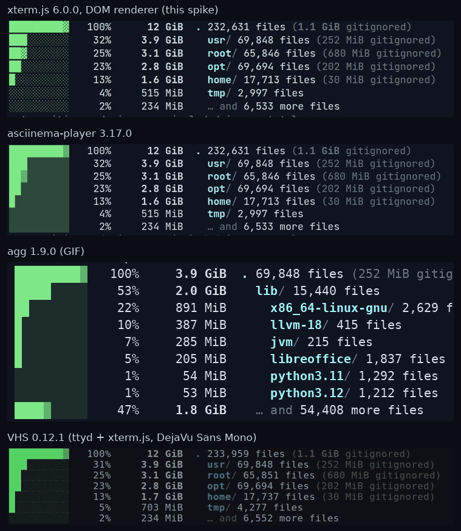

# Research: Automated Terminal Demo Recordings for the Web and Video

**Date:** 2026-10-04

**Author:** Claude (agent), for the fdu maintainer

**Status:** Complete; spike built and measured, recommendation proposed

## Overview

fdu needs demos that show what it does on real trees at the speed it does it: embedded
on a web page, and as clean, professional video.
The requirement is a fully automated pipeline.
A script runs the commands, the real output and its timing are captured, and the same
capture is replayed in a browser or rendered to video.
Nothing is sped up or mocked, except the typing.

This brief surveys the open-source options as of October 2026, then measures a spike of
the recommended pipeline against VHS, agg, and asciinema-player on fdu’s own output.
The spike is in
[explorations/terminal-demos](../../../explorations/terminal-demos/README.md), and the
measurements are in the
[evidence file](evidence/terminal-demo-recordings-2026-10-04.json).

The decision this informs is which toolchain fdu adopts for README, docs-site, and
release-announcement demos, and whether those demos can serve as performance evidence.

## Questions to Answer

1. Which tools can run a scripted terminal session for real, non-interactively, and keep
   real output timing?
2. Which can replay that capture in a browser, and which can turn it into high-quality
   MP4 or WebM?
3. Do the existing tools preserve timing well enough that a recording is honest evidence
   of speed?
4. How do the renderers handle what fdu actually prints: block-element bars, shade
   glyphs, 16-color ANSI, dim text, and a live progress line?
5. What carries over from the `jlevy/squares` video pipeline, which already produces
   clean video from web animations?

## Scope

In scope: open-source tools for driving, capturing, replaying, and exporting terminal
sessions, including 2025–2026 entrants; a working spike on three real fdu scenarios; and
frame-level verification of timing.

Out of scope: hosted services (asciinema.org, Screen Studio, Warp) beyond a mention;
voice-over and editing; and macOS capture.
The spike ran in one Linux container (x86_64, 4 vCPU, virtualized, running as root), so
its timings show the pipeline’s fidelity, not fdu’s performance on any user’s machine.
[Platform tuning](../guides/platform-tuning.md) explains why the regime matters.

Method: web and registry research, with an agent-assisted survey of about 45
repositories (the [Appendix](#appendix-tool-survey) holds it), plus the spike.
All tools were installed from registries: asciinema 3.2.0 from crates.io, agg 1.9.0 from
git, VHS 0.12.1 through the Go proxy, ttyd 1.7.4 from apt, and npm packages resolved
with `npm install --before=2026-09-19`.

## Findings

### The Problem Has Four Layers, and No One Tool Covers Them

| Layer | Job | Mature options |
| --- | --- | --- |
| Drive | Type commands at a human cadence and run them | VHS tapes, autocast YAML, demo-magic, doitlive, a small script |
| Capture | Record real output with real timing | asciinema 3 (`rec --headless`), tui-test, headless-terminal (`ht record`) |
| Replay | Play the capture in a browser | asciinema-player, xterm.js, ghostty-web, restty |
| Export | Turn the capture into GIF, MP4, WebM | agg (GIF only), VHS (its own capture only), frame-stepped headless Chromium |

The asciicast format is the seam between them.
[asciinema 3.0](https://blog.asciinema.org/post/three-point-o/) (September 2025) is a
Rust rewrite with a v3 format whose events are intervals.
A v3 cast stores output and chapter markers as JSON lines, and the spike’s 16- to
33-second fdu sessions are 6.5–12 KB each.

The gap is export. [agg](https://github.com/asciinema/agg) makes GIF only, and its
maintainers closed the MP4/WebM request
([agg#89](https://github.com/asciinema/agg/issues/89)) as not planned.
asciinema-player has no export.
The cast-to-MP4 converters found are dormant or one-day projects:
[asciinema-mp4](https://github.com/lhr0909/asciinema-mp4) is a 2023 Remotion template,
and [asciinema2video](https://github.com/xiaohanyu/asciinema2video) records a Puppeteer
screen in real time.
VHS makes video but cannot write or read a cast.

### Capture: asciinema Headless Records Real Execution Cleanly

`asciinema rec --headless --window-size 104x30 --command <driver>` records whatever the
driver does in a real PTY at a fixed size.
The spike’s driver ([record.py](../../../explorations/terminal-demos/record.py)) prints
a prompt, types each command with seeded jitter, and runs it in the same PTY, so color
detection, `COLUMNS`, and fdu’s progress line behave as they do for a person.
At each step boundary it writes an OSC sequence that no terminal acts on, then rewrites
those into asciicast `m` (marker) events.
Markers give the web player chapters and give the receipt exact step times.

Recording did not measurably slow the program, since asciinema only reads the PTY. In
the real-time scenario, `du -sxh /` took 611 ms and `fdu / --one-filesystem` took 209 ms
(fdu’s own perf line: 200.4 ms for 232,631 files), matching runs made outside any
recorder. The CPython scenario shows a cold `--analyze code` at 767 ms with the live
progress line visible, then the cached rerun at 81 ms.

The receipt ([example](evidence/terminal-demo-recordings-2026-10-04.json)) records each
command, its wall time measured around the child process, and its offset in the cast.
A viewer can check the playback against it.

### Video: Frame-Stepped Rendering Is Exact; Real-Time Capture Is Not

The spike’s renderer ([render.mjs](../../../explorations/terminal-demos/render.mjs))
applies the `squares` pattern to a cast.
It loads one stage page in headless Chromium and seeks it to frame `i / fps` on the
cast’s own clock. It screenshots the stage and pipes PNG frames to ffmpeg.
The video never depends on how fast the machine renders.
A slow screenshot delays the encode, not the picture.

A frame whose interval holds no cast output reuses the previous screenshot.
Terminals are mostly static, so the 1,596-frame real-time video needed 158 screenshots.

| Video | Frames | Screenshots | Capture time | Size |
| --- | --- | --- | --- | --- |
| Real time, 1080p60 | 1,596 | 158 | 37.6 s | 717 KB |
| Real time, 2160p60 (same stage at 2× scale) | 1,596 | 158 | 123.1 s | 1.9 MB |
| CPython views, 1080p60 | 2,112 | 192 | 46.9 s | 1.3 MB |
| Live `--watch`, 1080p60 | 1,098 | 44 | 20.1 s | 795 KB |

[verify_timing.py](../../../explorations/terminal-demos/verify_timing.py) checks a
lossless render of the real-time recording frame by frame.
The picture must change exactly on the first frame at or after each output event, and
nowhere else. Both engines passed: 157 of 157 expected change frames, none missing, none
extra. Two bugs surfaced first, and the check caught both.
An unfocused xterm.js draws no cursor, so typed spaces were invisible (30 missing
frames). A lossy encode’s keyframe refresh reads as change, so the check runs on a
lossless render.

VHS, on an equivalent
[tape](../../../explorations/terminal-demos/comparisons/realtime.tape), did not preserve
the clock:

- `Set Framerate 60` produced a 25 fps MP4.
- A script with about 14 s of typing and sleeps produced a 10.2 s video, and the 3.5 s
  closing `Sleep` lasted about 2 s. Open issue
  [vhs#88](https://github.com/charmbracelet/vhs/issues/88) reports the same kind of
  speed error.
- Recording perturbed the measurement: fdu reported 278 ms for the same walk it does in
  200 ms unrecorded, because VHS screenshots headless Chromium while the command runs.
  A demo of speed cannot share the CPU with its camera.
- A non-ASCII prompt in a hidden `Type` line was mangled, so the setup stayed on screen.
- Fonts must be installed system-wide; the web-font JetBrains Mono fell back to a
  wide-spaced face.

VHS remains a good tool for scripted GIFs whose timing does not matter.
It is the wrong tool for demonstrating speed.

### Replay: Renderers Disagree on fdu’s Bars

fdu’s tree and list views draw bars from `█`, `▓`, and dim `░` glyphs.
How each renderer draws those decides whether the bars read as bars.

- **asciinema-player 3.17.0 and agg 1.9.0** share the avt terminal model.
  Both draw block elements as fills over the full line box and shades as alpha fills
  (`globalAlpha = 0.25` for `░` in the player’s source).
  Adjacent rows merge into one staircase-shaped blob, and the empty part of every bar
  becomes one flat dark rectangle.
- **xterm.js 6.0.0** draws its own block and shade glyphs.
  `░` becomes a dot texture, and a lineHeight of 1.0 leaves a hairline between rows, so
  each bar stays a separate bar and the gitignored share (`▓`) stays distinct.
- **VHS** uses xterm.js through ttyd, but at its line height the bars also merge.

Everything else rendered correctly in the xterm.js stage: 16-color ANSI, bold, dim, the
`\r`-rewritten progress line, clear-screen, and the watch view’s separators.
The asciinema-player frames inspected (the real-time scenario) rendered colors, bold,
and dim correctly too.
asciinema-player’s custom theme must be defined before `AsciinemaPlayer.create()`. The
player reads the theme once at mount and inlines the colors, so a theme added later is
ignored, and everything renders white.

For the web embed, a cast plus a small xterm.js player is about 10 KB of data, against
0.7–1.3 MB for the equivalent MP4. It stays selectable, copyable text, scales to any
width, and can link to chapters.

### The Field Moved in 2025–2026

The survey found a new category: Playwright-style harnesses for terminals.
Several embed libghostty, which shipped as a library in 2026.

- [microsoft/tui-test](https://github.com/microsoft/tui-test) was rewritten in Rust with
  CLI, Rust, Python, and JS interfaces.
  It runs real shells on Windows, Linux, and macOS with Alacritty, Ghostty, Rio, or
  xterm.js backends. It writes a cast for every session and can record GIF, APNG, or MP4.
  It is the closest single tool to this pipeline, but 0.1.0 was published on 2026-10-03,
  inside the 14-day cool-off, and is unproven.
- [headless-terminal](https://github.com/montanaflynn/headless-terminal) (`ht record`)
  and [andyk/ht](https://github.com/andyk/ht) offer scriptable headless terminals.
- [betamax](https://github.com/joshka/betamax) runs VHS-style tapes on libghostty
  without a browser, and writes MP4. It cannot write a cast.
- [ghostty-web](https://github.com/coder/ghostty-web) and
  [restty](https://github.com/wiedymi/restty) are xterm.js-compatible web terminals on
  libghostty-vt. Either could replace xterm.js in the stage if its glyph rendering proves
  better.
- [HyperFrames](https://github.com/heygen-com/hyperframes) (Apache-2.0) renders seekable
  HTML to deterministic MP4, the same method as the spike, as a general framework.
  [Remotion](https://github.com/remotion-dev/remotion) does the same, but its license
  requires a paid company license above three employees.

The older generation is dormant or archived: termtosvg, asciicast2gif, terminalizer,
svg-term-cli, autocast, and asciinema-automation.

### What Carries Over From `jlevy/squares`

The `squares` workbench publishes 1080p60 videos of its packing animations.
Its capture tool (`packages/workbench/tools/workbench_tools/capture_video.py`) is the
model for this pipeline, and five of its practices apply directly:

1. **Drive the page’s own clock.** The page exposes a seek API, and capture seeks it per
   frame. A video frame is then exactly the page’s drawing at that instant.
   The spike’s `window.stage.seek(t)` is the same contract.
2. **Wait for fonts before the first frame**, through a `fonts-ready` probe.
   The stage awaits `document.fonts.load` for each weight.
3. **Encode against a named delivery profile.** `squares` encodes with libx264,
   `-preset slow -crf 18`, a pinned H.264 level, yuv420p, and `+faststart`, and it
   refuses a file that does not conform.
   The spike’s 1080p60 output is tagged level 5.0 by default.
   A profile would pin 4.2, the lowest level that admits 1080p60.
4. **Write a receipt beside every video.** The receipt records the page digest, commit,
   dirty flag, Playwright, browser, and ffmpeg versions, and the encoder arguments.
   The spike writes a smaller receipt; a production version should adopt the full one.
5. **Check cadence after the encode.** `squares-workbench-check-cadence` finds repeated
   frames in motion. `verify_timing.py` is the terminal equivalent: changes must land
   exactly on the event grid.

What does not carry over is the cost.
`squares` captures every frame, 29,639 of them in 2,105 s for its long cut.
A terminal is static between events, so frame reuse makes capture take 1.2–1.5× the
video’s length at 1080p.

## Key Insights

- **One capture, two renderings.** The cast is the source of truth.
  The web player and the video renderer are the same page, so the embed and the MP4 are
  the same pixels, and a fix to one is a fix to both.
- **Honest speed needs a camera that is off during the take.** Record headless, measure
  around each command, and render later.
  Real-time screen capture, as measured with VHS, both drops time and slows the program
  it films; Puppeteer screen recorders and t-rec use the same method.
- **Determinism makes timing verifiable.** Because frames come from seeking, a
  mechanical check can prove every visible change sits on its event’s frame.
  The receipt then lets anyone check the speed the viewer sees against the speed that
  was measured.
- **The tool choice turns on fdu’s glyphs.** On generic CLI output, asciinema-player and
  xterm.js look equivalent.
  On fdu’s bar charts, only the xterm.js path keeps the bars legible, and that
  difference shows up only when the renderers are run on fdu’s real output.

## Comparison Matrix

| Criterion | VHS | asciinema + player + agg (stock) | asciinema capture + xterm.js stage (spike) | tui-test |
| --- | --- | --- | --- | --- |
| Real execution, scripted | Yes (tape) | Needs a driver | Yes (scenario TOML) | Yes (API) |
| Command timing in output | Distorted (25 fps, sleeps compressed) | Exact | Exact, verified frame by frame | Real in cast per its docs (not measured) |
| Recorder perturbs the program | Yes (fdu 200 → 278 ms) | No | No | Not measured |
| Web embed | MP4/GIF only | asciinema-player, chapters | xterm.js player, chapters | HTML trace viewer |
| Video | GIF, MP4, WebM | GIF only | MP4, WebM, any fps, 4K | GIF, APNG, MP4 |
| fdu bars legible | Partly (rows merge) | No (blob) | Yes | Not measured (backend-dependent) |
| Fonts | System only | Web fonts (player); system (agg) | Web fonts, same in both outputs | Backend-dependent |
| Maturity | Mature, active | Mature, active | Spike, about 550 lines | 0.1.0, one day old |
| Fits 14-day cool-off | 0.12.1 is 10 days old; older tags fit | Yes | Yes | Not yet |

## Options Considered

### Option A: VHS

**Description:** Write `.tape` files; VHS drives a shell through ttyd and headless
Chromium and encodes GIF, MP4, or WebM.

**Pros:**

- One tool, declarative, widely used, with a GitHub Action.
- Good enough for short GIFs where timing is decorative.

**Cons:**

- Measured timing distortion, and recording slows the program on screen.
- No cast output, so no lightweight web embed, chapters, or copyable text.
- System fonts only, and non-ASCII typing is unreliable.

### Option B: asciinema, asciinema-player, and agg As Shipped

**Description:** Record with asciinema, embed with asciinema-player, and make GIFs with
agg. Add a driver for scripting.

**Pros:**

- Mature, small, and the standard for casts, with markers, idle-time limits, and
  posters.
- Exact timing.

**Cons:**

- No MP4 or WebM path.
- fdu’s bars render as merged blocks in both the player and agg.

### Option C: asciinema Capture With an xterm.js Stage and Frame-Stepped Export (Recommended)

**Description:** The spike.
`record.py` drives scenarios inside `asciinema rec --headless` and writes casts with
markers and a receipt.
`web/stage.html` plays a cast with xterm.js.
`render.mjs` seeks that same page per frame and encodes with ffmpeg.
`verify_timing.py` proves frame alignment.

**Pros:**

- Exact, verifiable timing, and an unperturbed program.
- One renderer for the web and video, with web fonts and full styling control.
- Every output from one cast: MP4, WebM, 4K, and GIF through agg if wanted.
- Every dependency is mature and permissively licensed (asciinema CLI GPL-3.0 as a tool,
  xterm.js MIT, playwright-core Apache-2.0).

**Cons:**

- About 550 lines to own, though nearly all of it is glue.
- The web player is minimal: play, pause, scrub, chapters.
  It is not a full player.
- Needs Chromium and ffmpeg on the rendering machine.

### Option D: A Video Framework (HyperFrames or Remotion) Hosting the Stage

**Description:** Keep the cast and stage, but let a framework do the frame stepping and
add titles, captions, and transitions between scenes.

**Pros:**

- Titles, transitions, and multi-scene composition come with the framework.
- HyperFrames is Apache-2.0.

**Cons:**

- Much larger dependency trees for what the spike does in 100 lines.
- Remotion’s company license.
- Worth revisiting only when demos need editing, not just recording.

### Option E: microsoft/tui-test

**Description:** Use tui-test’s API to drive sessions, and its cast and MP4 outputs.

**Pros:**

- One maintained tool covers drive, capture, and export.
- Native emulator backends on three platforms.

**Cons:**

- One day old at writing, and blocked by the cool-off.
- Video rendering and glyph fidelity not yet measured.
- Re-evaluate in a later round.
  Its casts could feed Option C’s renderer either way.

## Recommendations

1. **Adopt Option C as fdu’s demo pipeline.** Promote `explorations/terminal-demos` into
   a maintained tool once the follow-ups below land.
   Keep casts as the committed source and render videos as release assets, never
   committed, as `squares` does.
2. **Embed casts, not videos, on web pages that fdu controls.** Use the xterm.js player.
   Use MP4 only where a page cannot run script (social posts, slides, release notes).
3. **Treat a recording as performance evidence only with its receipt and regime.**
   Record on the platform and hardware being claimed, with the receipt’s measured times
   beside the video, as the [performance loop](../guides/performance-loop.md) requires
   of any number. This container’s timings are not fdu’s.
4. **Use VHS only for decorative GIFs**, and never for anything whose timing is the
   point.

## Next Steps

- [ ] Adopt the `squares` delivery profiles: pinned H.264 level (4.2 for 1080p60), CRF
  and preset per profile, and conformance refusal.
- [ ] Extend the video receipt to the `squares` shape: commit, dirty flag, cast digest,
  stage digest, and tool versions.
- [ ] Record the canonical demos on macOS bare metal and on a Linux workstation, cold
  and warm, so speed claims carry their regime.
- [ ] Add a poster-frame and chapter-thumbnail step for docs embeds.
- [ ] Re-evaluate tui-test, ghostty-web, and restty after the cool-off, focusing on
  glyph rendering of fdu’s bars.

## Open Questions

- Should fdu’s bars stay legible under the avt renderer?
  asciinema-player is the default embed on many sites; a renderer-independent bar style
  (or an upstream option for a line gap) would help every fdu user who records a cast.
- How should cold-cache demos be staged?
  Dropping the page cache needs root on Linux and `purge` on macOS, and the receipt
  should say which state a run had.
- When the only unlisted root branch is an empty directory, the tree prints
  `… and 0 more files` at 0 B (seen in the watch scenario before `logs/` filled).
  Is that row intended, or should the
  [output design](../architecture/fdu-output-design.md) omission rules drop it?

## References

- [asciinema 3.0 announcement](https://blog.asciinema.org/post/three-point-o/)
- [asciinema](https://github.com/asciinema/asciinema),
  [asciinema-player](https://github.com/asciinema/asciinema-player),
  [agg](https://github.com/asciinema/agg), [avt](https://github.com/asciinema/avt)
- [VHS](https://github.com/charmbracelet/vhs) and
  [vhs#88](https://github.com/charmbracelet/vhs/issues/88)
- [xterm.js](https://github.com/xtermjs/xterm.js)
- [microsoft/tui-test](https://github.com/microsoft/tui-test)
- [HyperFrames](https://github.com/heygen-com/hyperframes),
  [Remotion license](https://raw.githubusercontent.com/remotion-dev/remotion/HEAD/LICENSE.md)
- `jlevy/squares`: `packages/workbench/README.md` (publishing procedure) and
  `packages/workbench/tools/workbench_tools/{capture_video,delivery,cadence}.py`

## Appendix: Tool Survey

Collected on 2026-10-04 by a research subagent from GitHub search, crates.io, npm, PyPI,
and the Go module proxy, plus READMEs and issue searches.
Release-page dates read through the web were often wrong by a year, so they are used
only where a registry or changelog agrees and otherwise marked unverified.
Legend: **PTY** runs real processes in a pseudo-terminal; **Script** can be driven
non-interactively; **Timing** Y real, P partial (synthetic typing, real output), N
synthetic; **Web** has a browser player or embed.

| Project | Stars | License | Latest release (date) | Last push / status | Lang | Outputs | PTY | Script | Timing | Web |
| --- | --- | --- | --- | --- | --- | --- | --- | --- | --- | --- |
| asciinema/asciinema (CLI 3.x) | 17.9k | GPL-3.0 | 3.2.1 (2026-06-16 per CHANGELOG; crates.io latest is 3.2.0, 2026-03-01) | 2026-08-14, active | Rust | .cast (asciicast v3 default, v2), raw, txt (`convert`), live stream | Y | Y (`rec --headless --command`; no input scripting) | Y (`--idle-time-limit` optional) | via player |
| asciinema/asciinema-player | 2.9k | Apache-2.0 | 3.17.0 (npm 2026-06-30) | 2026-09-13, active | JS + Rust/WASM | live web player (cast v1/v2/v3, live streams) | n/a | n/a | Y | Y |
| asciinema/agg | 1.7k | GPL-3.0 | v1.9.0 (2026-05-29, year unverified) | 2026-08-14, active | Rust | GIF only | n/a | Y | Y (fps cap, speed, idle limit) | N |
| asciinema/avt | 233 | Apache-2.0 | 0.18.0 (crates 2026-05-05) | 2026-08-14, active | Rust | VT emulator library | n/a | n/a | n/a | (inside player, as WASM) |
| asciinema/asciinema-server | 2.5k | Apache-2.0 | not checked | active (updated 2026-10) | Elixir | hosting, sharing | n/a | n/a | n/a | Y |
| charmbracelet/vhs | 21.1k | MIT | v0.12.1 (tag 2026-09-24) | 2026-10-01, active | Go | GIF, MP4, WebM, PNG frames, .txt/.ascii golden | Y (shell via ttyd) | Y (.tape) | P/N (synthetic typing; frames taken by wall clock from headless Chrome) | N |
| charmbracelet/freeze | 4.9k | MIT | v0.2.2 (2025-04-01) | 2026-09-16 | Go | PNG, SVG, WebP/JPG (static) | Y (`--execute`; PTY use unverified) | Y | n/a | N |
| xtermjs/xterm.js | 21.3k | MIT | @xterm/xterm 6.0.0 (2025-12-22); addon-serialize 0.14.0; addon-webgl 0.19.0; @xterm/headless 6.0.0 | 2026-09-13, active | TS | live web terminal; serialize buffer to VT/HTML | n/a | n/a | n/a | Y |
| coder/ghostty-web | 2.9k | MIT | 0.4.0 (npm 2025-12-09); 0.4.0-next.* prereleases to 2026-06-28 | 2026-07-02; slowing | TS + Zig/WASM | xterm.js-compatible web terminal | n/a | n/a | n/a | Y |
| wiedymi/restty | 410 | MIT | 0.3.0 (npm 2026-09-05) | 2026-09-05, active (early release) | TS + WASM | web terminal (libghostty-vt, WebGPU/WebGL2); `restty/headless` | n/a | n/a | n/a | Y |
| k9withabone/autocast | 147 | GPL-3.0 | 0.1.0 (crates 2023-07-20) | 2024-05-22, dormant | Rust | .cast (v2, inferred) | Y | Y (YAML) | P (synthetic typing, real command output, inferred) | via player |
| tsingletaryTT/tt-demo-maker | 0 | Apache-2.0 | none | 2026-10-01, personal project | Rust + bash | cast, GIF, MP4 (by orchestrating tmux, asciinema, VHS, agg, ffmpeg) | Y | Y (YAML) | Y (real capture) | N |
| PierreMarchand20/asciinema_automation (PyPI asciinema-automation) | 34 | MIT | 0.2.2 (PyPI 2024-07-11) | 2024-07-28, dormant | Python | .cast (drives `asciinema rec` via pexpect) | Y | Y | Y (real time, Gaussian keystroke delays) | via player |
| sloria/doitlive | 3.6k | MIT | 5.2.1 (PyPI 2026-02-16) | 2026-09-08 (mostly bot activity) | Python | live presentation, no file output | Y (runs commands) | N (needs keypresses by design) | live | N |
| paxtonhare/demo-magic | 1.9k | MIT | no releases | last commit 2026-09-17 | Shell | live, no file output | Y (`pe` runs commands) | Y (`-n` no-wait) | P (simulated typing) | N |
| faressoft/terminalizer | 16.2k | MIT | 0.12.0 (npm 2024-08-29) | 2024-08-29, dormant | JS (Node/Electron) | YAML recording, GIF, web player, terminalizer.com share | Y (node-pty) | P (records interactively; YAML delays editable) | P (editable) | Y |
| sassman/t-rec-rs | 1.3k | GPL-3.0 | 0.8.2 (2025-12-19); 0.9.0-preview4 (2026-07-08) | 2026-09-21, active | Rust | GIF, MP4 (screenshots of a real OS window) | Y | P (runs a program; needs a display) | Y (4–15 fps capture) | N |
| nbedos/termtosvg | 9.8k | BSD-3-Clause | 1.1.0 (PyPI 2020-01-18) | **archived** (last push 2020-06) | Python | animated SVG; reads asciicast v1/v2 | Y | Y | Y | SVG embed |
| marionebl/svg-term-cli | 4.2k | MIT | 2.1.1 (npm 2018-01-21) | 2024-05-01, unmaintained | JS | cast to animated SVG | n/a | Y | Y | SVG embed |
| shellcell/ttysvg | 1 | MIT | v0.1.2 (Go 2026-07-19) | active (new 2026-07) | Go | SMIL+CSS SVG; converts asciicast v2/v3 | Y | Y (`-headless`, `-- cmd`) | Y | SVG embed |
| Nuu-maan/ttysvg (same name, different project) | 7 | MIT | none (cargo install from git) | 2026-08-04 (new) | Rust | SVG with light and dark palettes, plus a .tape and frame JSON | Y (incl. Windows ConPTY) | Y (tape) | P (`trim-idle` defaults to 1s; `off` keeps real timing) | SVG embed |
| “asg” (Asciinema SVG Generator) | not found | — | — | **could not identify a canonical repo** | — | — | — | — | — | — |
| Quasiflo/nemasvg (closest “asciinema to SVG generator”) | 1 | Apache-2.0 | 0.2.0 (crates 2026-09-24) | 2026-10-04 (new) | Rust | animated SVG, fonts embedded; asciicast v3 only | n/a | Y | Y | SVG embed |
| MrMarble/termsvg | 388 | GPL-3.0 | v0.11.0 (Go 2026-07-15) | 2026-07-15 | Go | .cast (rec), SVG (export) | Y (`rec -c`; no `rec` on Windows) | Y | Y | SVG embed |
| pamburus/termframe | 141 | MIT | v0.8.8 (date unverified; repo created 2025-03) | 2026-10-02, active | Rust | static SVG screenshot of one command | Y (own virtual terminal) | Y | n/a | SVG embed |
| xiaohanyu/asciinema2video | 4 | MIT | 1.0.2 (npm 2025-12-17) | 2025-12-17 (one-day project) | TS | cast to MP4 (Puppeteer + asciinema-player + screen recorder) | n/a | Y | P (real-time screen capture; jitter risk, inferred) | N |
| lhr0909/asciinema-mp4 | 38 | MIT (README; GitHub detects none) | none | 2023-01-30, dormant | TS | cast to MP4 via Remotion + asciinema-player (template) | n/a | P | Y (deterministic frame render, inferred) | N |
| asciinema/asciicast2gif | 1.2k | MIT | — | **archived** (2022-08) | JS/CSS | GIF (superseded by agg) | n/a | Y | Y | N |
| remotion-dev/remotion | 61.7k | Remotion License (source-available; company license needed above the free tier) | 4.0.532 (npm 2026-10-01) | 2026-10-03, active | TS/React | MP4/WebM etc. from React | n/a | Y | deterministic | Y (player) |
| midrender/revideo (formerly redotvideo/revideo) | 4.1k | MIT | @revideo/core 0.11.0 (2026-07-10) | 2026-07-15 | TS | video from TS scenes (Motion Canvas fork) | n/a | Y | deterministic | Y (React player) |
| motion-canvas/motion-canvas | 19.2k | MIT | @motion-canvas/core 3.17.2 (2024-12-14) | 2026-07-02; releases stalled | TS | video/image sequences | n/a | Y | deterministic | Y (player element) |
| heygen-com/hyperframes (new, 2026) | 56.4k | Apache-2.0 | 0.8.120 (npm 2026-10-04) | 2026-10-04, very active | TS | deterministic MP4 from HTML (seeks headless Chrome frame by frame, then ffmpeg) | n/a | Y | deterministic | Y (preview) |
| JavaCS3/xterm-player | 110 | MIT | 1.1.0 (npm 2020-04-11) | 2022-12-09, dormant | TS | web player (xterm.js) for casts/ttyrec | n/a | n/a | Y | Y |
| tsl0922/ttyd | 12.5k | MIT | 1.7.7 (2024-03-30) | 2026-08-12 | C | share a live terminal over the web (xterm.js, WebGL) | Y | n/a | live | Y |
| yudai/gotty | 19.6k | MIT | v1.0.1 (2017) | 2024-08-01, abandoned | Go | live web terminal | Y | n/a | live | Y |
| sorenisanerd/gotty (maintained fork) | 2.6k | MIT | v1.8.0 (2026-05-24) | 2026-08-05 | Go | live web terminal | Y | n/a | live | Y |
| microsoft/tui-test | 277 | MIT | 0.1.0 (npm 2026-10-03; also crate tui-test-rs, PyPI tui-test) | 2026-10-03, very active (Rust rewrite) | Rust (+JS/Py bindings) | .cast (automatic per session), APNG, GIF, MP4, SVG/PNG screenshots, HTML trace | Y (Win/Linux/macOS) | Y (CLI and Rust/Python/JS API) | Y (cast); fps/speed/idle options for video | trace.html |
| remorses/tuistory | 366 | MIT (npm field; no LICENSE file found) | 0.11.0 (npm 2026-08-10) | 2026-08-21, active | TS (Bun) | text snapshots, PNG screenshots; **no recording** | Y (ghostty-opentui) | Y ("Playwright for terminals" API) | n/a | N |
| andyk/ht (headless terminal) | 909 | Apache-2.0 | not checked | updated 2026-09-26 | Rust (avt) | JSON over stdio, live web preview | Y | Y | n/a | Y (preview) |
| montanaflynn/headless-terminal (`ht`) | 119 | MIT | v0.3.2 (Go 2026-08-31) | 2026-08-31, active | Go + libghostty-vt | asciicast (`ht record`), PNG/HTML/ANSI/JSON views | Y | Y | Y | N |
| joshka/betamax (new) | 39 | MIT | 0.1.21 (crates 2026-09-19) | active (updated 2026-09-28) | Rust + libghostty-vt | GIF, PNG, MP4, WebM, JSON (VHS-style tapes, no browser) | Y | Y | P (tape-driven like VHS, inferred) | N |
| homeport/termshot | 974 | MIT | v0.6.1 (2026-02-09) | active | Go | PNG screenshot of command output | Y | Y | n/a | N |
| dstein64/gifcast | 244 | MIT | — | 2026-02-17 | JS | cast to GIF in the browser | n/a | P | Y | Y (web app) |
| arthurdick/term-to-svg | 42 | MIT | — | 2025-10-08 | PHP | `script` logs to animated SVG | n/a | Y | Y | SVG embed |
| bitplane/sh2mp4 | 1 | WTFPL + warranty clause | 0.3.5 (PyPI 2025-08-22) | 2026-07-30 | Python | MP4 (xterm in a hidden X session); converts .cast | Y | Y | Y (real-time capture) | N |
| asciicast2movie (PyPI) | n/a | MIT | 0.3.5 (2021-02-25) | dormant | Python | cast to video (pyte + moviepy) | n/a | Y | Y | N |
| Malinskiy/spielbash | 45 | MIT | — | 2026-07-13 (activity type unverified) | Ruby | .cast via tmux automation | Y | Y | P | via player |

<!-- This document follows common-doc-guidelines.md.
See github.com/jlevy/practical-prose and review guidelines before editing.
-->
